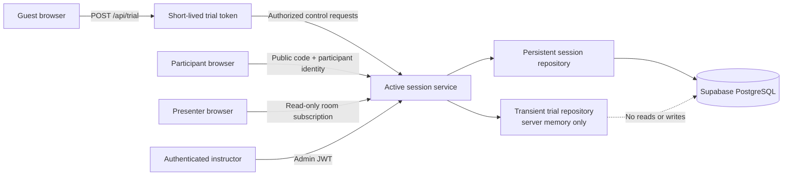

# Guest Trial Specification

**Working name:** Try It Out  
**Status:** Implemented; pending production deployment  
**Target release:** v1.2.1  
**Related internal plan:** `MULTI_ADMIN_PLAN.md`  
**Last updated:** July 2026

## 1. Summary

Markdown Mash should offer a public, no-account trial that lets a visitor experience the complete instructor-to-participant flow without gaining access to the real instructor account or storing anything alongside classroom data.

From the instructor sign-in screen, a visitor selects **Try It Out**. Markdown Mash opens a temporary Guest Studio with a fun, preloaded quiz. The visitor can preview it, launch a room, open the presenter, join from another tab or device, answer the questions, and see the live results and podium finale.

The trial is intentionally temporary:

- It does not authenticate as an admin.
- It cannot access instructor settings, history, analytics, exports, or existing sessions.
- Trial sessions, participant names, answers, and results are held in server memory only.
- Trial data is automatically destroyed when the trial expires or the server restarts.
- It never writes to the production Supabase tables.

This is a focused guest experience, not multi-tenancy. It can ship before full multi-admin support, while establishing authorization boundaries that the future multi-tenant design can reuse.

### Product decision: temporary by design

Markdown Mash will not operate a persistent hosted free tier in this release. The trial exists to let someone experience the product before deciding whether to deploy their own free, open-source instance.

This means:

- There is no trial-to-account upgrade path.
- Trial rooms, quizzes, participants, answers, and results cannot be saved.
- Trial data cannot be exported or transferred into the instructor workspace.
- The primary completion call-to-action is **Deploy your own Markdown Mash**.
- A future multi-tenant hosted service would be a separate product decision, not an extension of guest storage.

## 2. Goals

### Product goals

1. Let a visitor experience Markdown Mash without credentials or setup.
2. Demonstrate the full product loop: instructor controls, participant joining, live questions, between-question momentum, and the podium finale.
3. Make the trial playful and understandable without documentation.
4. Keep the real instructor workspace and classroom data completely isolated.
5. Give open-source visitors a clear next step after the trial.

### Success signals

- A visitor can launch a trial room within one minute.
- A visitor can test both the instructor and participant experiences using two tabs.
- No trial activity appears in the real session history, analytics, course totals, exports, or activity logs.
- A visitor cannot read or control another visitor's trial or any real classroom session.
- A completed trial reaches the same results and podium experience as a real session.

## 3. Non-goals

The first guest-trial release will not provide:

- Guest accounts, registration, or email collection.
- Saved quizzes or saved trial history.
- Persistent guest analytics.
- Access to the real analytics workspace.
- Multiple guest-owned quizzes or simultaneous rooms per trial.
- Arbitrary Markdown uploads.
- Full multi-admin or organization tenancy.
- A shared guest password for the existing admin account.

Arbitrary Markdown editing is also excluded from the first release. Rendering untrusted Markdown safely requires a separate sanitization review. The initial trial displays the preloaded Markdown so visitors can understand the format, but treats it as read-only.

## 4. User experience

### 4.1 Entry point

The instructor sign-in card gains a secondary action:

```text
[ Open instructor studio ]

----------- or -----------

[ Try It Out ]
No account needed · Temporary 20-minute room
```

**Try It Out** must be visually inviting but must not make the real sign-in action ambiguous.

The public landing page may also add a smaller **Try it out** link near **Instructor sign in**, but the canonical entry point remains the instructor sign-in screen.

### 4.2 Trial welcome

Selecting **Try It Out** creates a temporary trial and opens the **Guest Studio**.

The first screen explains:

- This is a temporary playground.
- Nothing is saved.
- The room expires in 20 minutes.
- Visitors should not enter real student information.
- They can open a participant view in another tab to play along.

Suggested heading:

> Your practice room is ready.

Suggested supporting copy:

> Run a quick Mash, join from another tab, and see the classroom experience from both sides. Nothing here is saved.

### 4.3 Preloaded quiz

The Guest Studio shows:

- Quiz title and question count.
- The preloaded Markdown in a read-only editor.
- A **Preview quiz** action.
- A primary **Launch practice room** action.
- A short note that self-hosted instructors can create or upload their own Markdown quizzes.

The first trial quiz is **Mini Mash: Quick Wins**, a five-question mix of basic math, patterns, and logic. It should be simple enough for anyone to play and varied enough to demonstrate timers, distributions, scoring, streaks, movement, and the podium.

### 4.4 Room launch

After launch, the Guest Studio uses the existing live instructor workspace with a visible **Guest Trial** badge and countdown.

It provides:

- A six-character session code and QR code.
- **Open participant view** in a new tab.
- **Open presenter** in a new tab.
- Copy code and copy join link.
- Live participant count and names.
- Start, next question, end question, show results, and end session controls.

The participant tab uses the standard join and play experience. The presenter uses the standard projector experience.

### 4.5 Guided self-test

Because many visitors will be testing alone, the room should include a compact prompt:

> Want to play too? Open the participant view in a new tab, enter a nickname, then return here to run the room.

The trial must not create a fake participant automatically. Real joining demonstrates the product more honestly and validates the multi-tab experience.

### 4.6 Completion

The trial includes the complete v1.2.0 finale:

- Third-, second-, and first-place podium reveal.
- Fourth- and fifth-place recognition when present.
- Hardest-question recap.
- Personal score, rank, correct-answer count, and best streak.

The Guest Studio then shows:

- **Run it again**, if enough trial time remains.
- **View on GitHub**.
- **Deploy your own Markdown Mash**.
- A reminder that trial data will disappear.

It does not link to the real analytics workspace.

Suggested completion copy:

> Had fun? Markdown Mash is free and open source. Deploy your own instance to create quizzes and keep your classroom results.

### 4.7 Expiration

The trial expires 20 minutes after creation. A visible countdown appears in the Guest Studio.

At five minutes remaining, show a non-blocking warning. At expiration:

- Stop the active question.
- Notify the guest controller, presenter, and participants.
- Remove the trial from server memory.
- Reject further joins or control actions.
- Return the guest to a friendly expiration screen with **Start a new trial**.

A server restart also ends all trials. This is acceptable and should be explained as part of the temporary experience.

## 5. Preloaded quiz content

The server-owned template should live outside the public upload workflow, for example:

```text
demo-quizzes/quick-wins.md
```

Proposed content:

````markdown
# Mini Mash: Quick Wins
# Score 100

## Q1: What is 7 × 8?
- [ ] 48
- [ ] 54
- [x] 56
- [ ] 64
::time=15

## Q2: What number comes next: 1, 1, 2, 3, 5, ...?
- [ ] 6
- [ ] 7
- [x] 8
- [ ] 10
::time=20

## Q3: Half of 30 plus 5 equals...
- [ ] 10
- [ ] 15
- [x] 20
- [ ] 25
::time=20

## Q4: Which shape has exactly three sides?
- [ ] Square
- [x] Triangle
- [ ] Circle
- [ ] Pentagon
::time=15

## Q5: Three cats each have four paws. How many paws altogether?
- [ ] 7
- [ ] 10
- [x] 12
- [ ] 16
::time=15
````

Future versions may offer a small server-owned template gallery, such as Quick Math, Brain Teasers, and Tech Basics. User-created public templates remain out of scope until content sanitization and moderation are designed.

## 6. Roles and permissions

The application should use explicit principals rather than treating every controller as an admin.

| Principal | Can join | Can present | Can control | Can use analytics/settings | Can persist data |
|---|---:|---:|---:|---:|---:|
| Master admin | Yes | Yes | Any owned/authorized real session | Yes | Yes |
| Future regular admin | Yes | Yes | Own real sessions | Own data only | Yes |
| Trial controller | Yes | Own trial only | Own trial only | No | No |
| Participant | Own room | No | No | No | Trial-dependent |
| Presenter | No | Current room, read-only | No | No | No |

A trial controller must never receive an admin JWT or an admin database row.

## 7. Architecture



### 7.1 Session classification

Every active session must declare its persistence and controller:

```js
{
  kind: 'persistent' | 'trial',
  controller: {
    type: 'admin' | 'trial',
    id: 'principal-id'
  },
  expiresAt: null | 1234567890,
  participantLimit: null | 8
}
```

Authorization checks must use these fields for every control action.

### 7.2 Persistence boundary

Database calls are currently spread across session creation, joining, answering, scoring, ending, and recovery. The trial must not rely on scattered `if (session.kind !== 'trial')` checks because a missed check could leak trial data into Supabase.

Introduce a session repository boundary with the operations needed by the live engine:

```js
createSession()
updateSessionStatus()
createParticipant()
updateParticipantSocket()
isParticipantKicked()
kickParticipant()
recordAnswer()
updateParticipantScore()
deleteSession()
```

Provide two implementations:

- **PersistentSessionRepository** delegates to the existing PostgreSQL functions.
- **TransientSessionRepository** stores only what the live session needs in memory and never imports or calls `db.js`.

The live quiz engine selects the repository when the session is created and uses it for all subsequent persistence operations.

### 7.3 Trial token

Creating a trial returns a short-lived signed token with claims similar to:

```json
{
  "sub": "trial_uuid",
  "type": "trial",
  "scope": ["trial:control"],
  "sessionCode": "T4K8WP",
  "exp": 1785342000,
  "aud": "markdown-mash-trial"
}
```

Requirements:

- Use a dedicated server-side trial-token secret.
- Use a distinct audience or token type from admin JWTs.
- Expire with the trial.
- Store in `sessionStorage`, not `localStorage`.
- Never place the token in the join URL, presenter URL, logs, or QR code.
- Bind it to one trial session.

### 7.4 HTTP authorization

All instructor endpoints—not only settings endpoints—must require an authenticated principal and verify session ownership.

Suggested trial endpoints:

```text
POST   /api/trial
GET    /api/trial/session
POST   /api/trial/session/launch
GET    /api/trial/session/:code/qr
POST   /api/trial/session/:code/end
POST   /api/trial/session/:code/replay
```

The exact route shape may be consolidated, but trial routes must never proxy requests to global admin history or analytics.

Real instructor endpoints retain `/api/admin/*` and require an admin token. Session-specific admin endpoints must additionally verify that the authenticated admin owns or is permitted to manage the target session.

### 7.5 Socket.IO authorization

Socket control events are as sensitive as HTTP control routes.

The controller passes its admin or trial token during the Socket.IO handshake. The server verifies it once, stores the principal on `socket.data`, and checks that principal against the requested session before allowing:

- `admin_join`
- `start_quiz`
- `next_question`
- `end_question`
- `end_session`
- Kick or moderation events

A valid trial token can control only the session code in its claims. A second trial token must receive `forbidden` when attempting to control the first trial.

Participant sockets remain scoped to a participant ID and room code. Presenter sockets remain read-only and must never acquire controller privileges merely by joining the presenter room.

### 7.6 Cleanup

Maintain trial expiration in a dedicated trial manager:

- Sweep expired trials at least once per minute.
- Clear pending timers where practical.
- Emit `trial_expired`.
- Remove the active session and token metadata.
- Disconnect or remove sockets from trial rooms.
- Enforce a global concurrent-trial ceiling.

Trial cleanup must not call database deletion because no trial rows should exist.

## 8. Isolation and privacy requirements

### Required guarantees

1. A trial request cannot list or fetch real sessions.
2. A trial request cannot access analytics, exports, instructor settings, recovery, or activity logs.
3. Trial participants and answers never enter `sessions`, `participants`, `answers`, `admins`, or `admin_activity_log`.
4. Trial data is not included in course, platform, participant, or question statistics.
5. One trial controller cannot control another trial.
6. A trial controller cannot control a real classroom session even if its code is known.
7. A participant or presenter cannot emit accepted instructor-control events.
8. Trial tokens are not accepted as admin tokens.
9. Admin tokens are still subject to session ownership checks.

### Supabase posture

The current application uses server-side PostgreSQL access rather than a browser Supabase client. Guest mode should preserve that boundary: no Supabase URL, database password, service-role credential, or equivalent secret may be sent to the browser.

Because the tables are created in the `public` schema, deployment hardening should also verify one of the following:

- The Supabase Data API is disabled because the application does not use it; or
- All exposed tables have appropriate grants and Row Level Security policies.

This is defense in depth. It does not replace application-level authorization in Express and Socket.IO.

Relevant Supabase guidance:

- [Securing your API](https://supabase.com/docs/guides/api/securing-your-api)
- [Row Level Security](https://supabase.com/docs/guides/database/postgres/row-level-security)

## 9. Abuse prevention and limits

Recommended configurable defaults:

| Limit | Default |
|---|---:|
| Trial lifetime | 20 minutes |
| Trials created per IP per hour | 5 |
| Concurrent trials per IP | 2 |
| Concurrent trials platform-wide | 25 |
| Participants per trial | 8 |
| Active rooms per trial | 1 |
| Questions | Fixed at 5 |
| Template size | Server-owned and fixed |

Environment variables:

```text
GUEST_TRIAL_ENABLED=false
GUEST_TRIAL_JWT_SECRET=
GUEST_TRIAL_TTL_MINUTES=20
GUEST_TRIAL_MAX_PARTICIPANTS=8
GUEST_TRIAL_MAX_CONCURRENT=25
GUEST_TRIAL_STARTS_PER_IP_HOUR=5
```

Additional requirements:

- Set Express proxy trust correctly for Render before relying on IP rate limits.
- Return friendly `429` and capacity messages.
- Do not log trial tokens or full participant payloads.
- Escape participant names wherever rendered.
- Generate trial IDs, participant IDs, and codes with Node's cryptographic random utilities and check codes against all active rooms.
- Keep the Markdown template read-only until rendered HTML is sanitized against script injection.
- Add a feature flag so guest access can be disabled immediately without removing the UI code.
- Keep the initial deployment on a single application instance. The current in-memory live-session model would require shared state and a Socket.IO adapter before horizontal scaling.

## 10. Current-state findings and prerequisites

The February 2026 multi-admin plan is directionally useful, but it is not an accurate description of all current protections.

As of the v1.2.0 code review:

- `owner_id` exists on `sessions`, but session creation does not currently assign it.
- Several session and analytics HTTP routes do not currently use `authenticateToken`.
- Socket.IO instructor-control events do not currently authenticate the controlling socket or verify session ownership.
- Analytics queries are global rather than owner-scoped.

These issues already matter for the real instructor account and become critical before introducing a public trial button.

The following work is therefore a **launch prerequisite**, not an optional multi-admin enhancement:

1. Authenticate every instructor HTTP action.
2. Authenticate Socket.IO controller connections.
3. Authorize every action against its target session.
4. Assign real sessions to their admin owner.
5. Scope real session/history/analytics queries to an authorized owner, while preserving explicit master-admin access where intended.
6. Add negative authorization tests before enabling `GUEST_TRIAL_ENABLED`.

## 11. Functional requirements

### FR-1: Public entry

- The instructor sign-in view displays **Try It Out** without requiring credentials.
- The action remains available when no admin session exists.
- The action does not create or impersonate an admin account.

### FR-2: Trial creation

- The server creates one short-lived trial principal and room.
- The browser receives only the trial token and trial-safe metadata.
- Rate and capacity limits are enforced before allocation.

### FR-3: Template experience

- The Guest Studio displays the Quick Wins template in read-only form.
- Preview uses the same parser and question UI as a real quiz.
- The visitor can launch the room without editing or uploading content.

### FR-4: Instructor experience

- The trial supports the normal lobby and quiz controls.
- Controls affect only the controller's own trial.
- Settings, analytics, history, export, metadata editing, recovery, and permanent deletion are absent.

### FR-5: Participant and presenter experience

- The normal participant page can join a trial by code.
- The normal presenter page can display a trial.
- Trial participants receive the same live questions, feedback, ranking movement, streaks, and finale as real participants.
- Joining stops at the configured participant cap.

### FR-6: Data lifecycle

- All trial state is transient.
- Ending a trial does not create analytics.
- Expiration or restart makes the code invalid.
- Starting a new trial creates a new identity and code.

### FR-7: Failure states

Provide friendly screens for:

- Trial capacity reached.
- Rate limit reached.
- Trial expired.
- Server restarted.
- Participant limit reached.
- Invalid or ended room.
- Lost or invalid controller token.

## 12. Accessibility and responsive behavior

- **Try It Out** is keyboard accessible and has an unambiguous accessible name.
- The guest badge and countdown do not rely on color alone.
- Countdown announcements are not overly verbose for screen readers.
- Focus moves to the Guest Studio heading after trial creation.
- Expiration warnings use an ARIA live region.
- The complete guest flow works on mobile, tablet, and desktop.
- Browser zoom remains enabled.
- New-tab actions state that they open a new tab.

## 13. Testing strategy

### Unit tests

- Trial-token creation, validation, audience, scope, and expiration.
- Principal-to-session authorization.
- Transient repository behavior.
- Trial cleanup and capacity counters.
- Participant limits.
- Quick Wins template parsing.

### Integration tests

- Trial creation succeeds without an admin token.
- Trial tokens fail on every `/api/admin/*` endpoint.
- Unauthenticated users fail on protected instructor endpoints.
- A trial controller can control its own room.
- A trial controller cannot control another trial or a real session.
- Participants and presenters cannot issue control commands.
- Admin ownership rules apply to HTTP and Socket.IO actions.
- Expired trials reject joins and controls.
- Trial completion leaves database row counts unchanged in all production tables.

### End-to-end tests

1. Start a trial from the login screen.
2. Preview the template.
3. Launch the practice room.
4. Open the participant in a second tab and join.
5. Run all five questions.
6. Confirm between-question feedback.
7. Confirm participant final feedback and presenter podium.
8. Confirm no trial appears in real analytics after admin login.
9. Repeat with two independent trial browsers and verify cross-control is rejected.
10. Validate the flow at mobile and desktop breakpoints.

### Security regression test

Capture database counts for:

```text
sessions
participants
answers
admins
admin_activity_log
```

Run a complete guest trial, including participants and answers, then assert that every count is unchanged.

## 14. Acceptance criteria

The feature is ready to enable when all of the following are true:

- [ ] A visitor can start a trial without an account.
- [ ] The Quick Wins quiz is preloaded and clearly marked as temporary.
- [ ] The visitor can preview, launch, present, join, answer, and complete it.
- [ ] The standard live results, momentum, streak, ranking, and podium features work.
- [ ] The visitor can test the flow using two browser tabs without identity collisions.
- [ ] Trial data never appears in Supabase or instructor analytics.
- [ ] All instructor HTTP routes require and verify an authorized principal.
- [ ] All Socket.IO control events require and verify an authorized controller.
- [ ] Cross-trial and trial-to-production control attempts return forbidden.
- [ ] Trial tokens expire and cannot be reused after expiration.
- [ ] Rate, participant, duration, and global capacity limits work.
- [ ] The guest experience passes keyboard, screen-reader, zoom, and responsive checks.
- [ ] `GUEST_TRIAL_ENABLED=false` removes or disables public trial creation.
- [ ] Automated unit, integration, security, and end-to-end tests pass.

## 15. Delivery phases

### Phase 0: Authorization foundation

- Protect all instructor HTTP routes.
- Authenticate and authorize Socket.IO control events.
- Assign and enforce session ownership.
- Add authorization regression tests.
- Verify Supabase Data API/RLS posture.

### Phase 1: Transient trial engine

- Add principal and session classifications.
- Add persistent and transient repository implementations.
- Add trial token issuance and verification.
- Add trial manager, limits, expiry, and cleanup.
- Add the server-owned Quick Wins template.

### Phase 2: Guest Studio

- Add **Try It Out** to instructor sign-in.
- Add welcome, timer, guest badge, template preview, and guided self-test.
- Hide persistent/admin-only navigation and actions.
- Add friendly trial failure and expiration states.

### Phase 3: Verification and launch

- Complete automated tests.
- Perform two-browser and mobile QA.
- Confirm zero database writes during a full trial.
- Launch behind the disabled feature flag.
- Enable in production after a final authorization audit.

## 16. Relationship to multi-admin

The guest trial should not be modeled as a special regular admin. It has a narrower capability set, no database identity, no ownership of persistent records, and a short lifetime.

However, its authorization foundation is directly useful for the future multi-admin work:

- Explicit controller principals.
- Session ownership.
- Owner-scoped API queries.
- Socket.IO authorization.
- Clear master-admin exceptions.
- Negative access-control tests.

After guest access ships, `MULTI_ADMIN_PLAN.md` should be revised around this principal-and-ownership model before implementing persistent regular-admin accounts.
