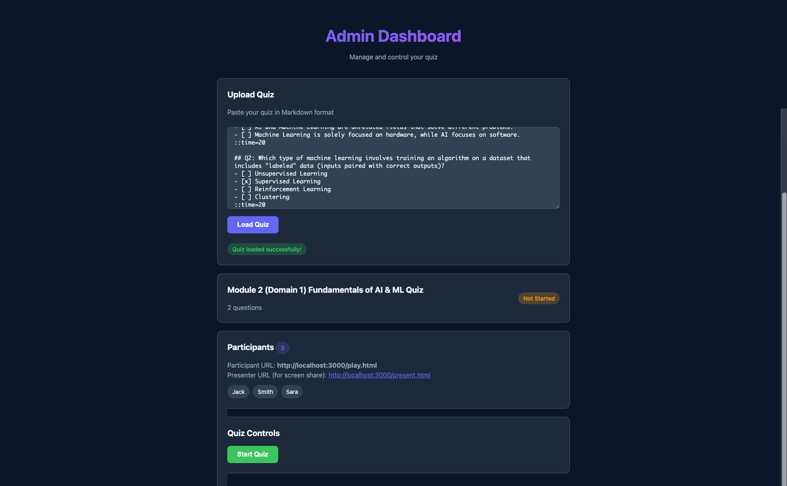
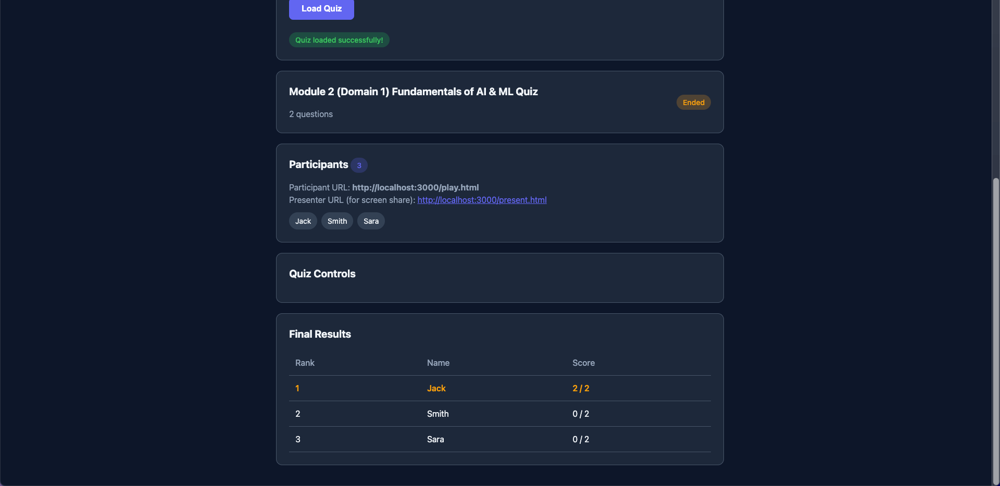
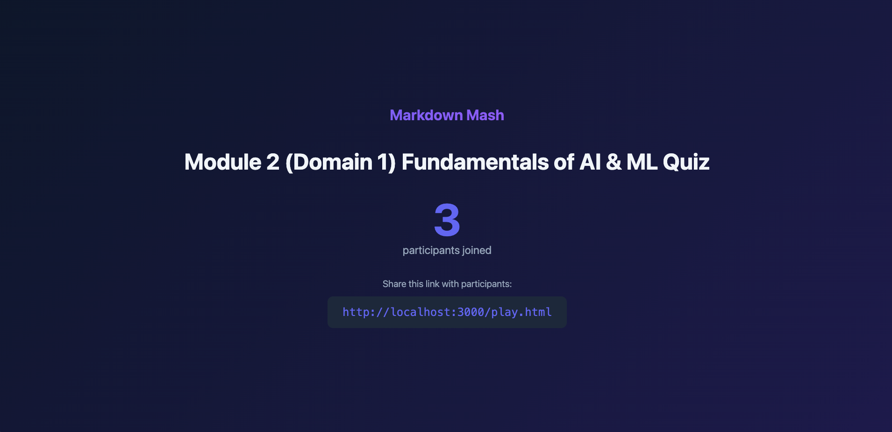
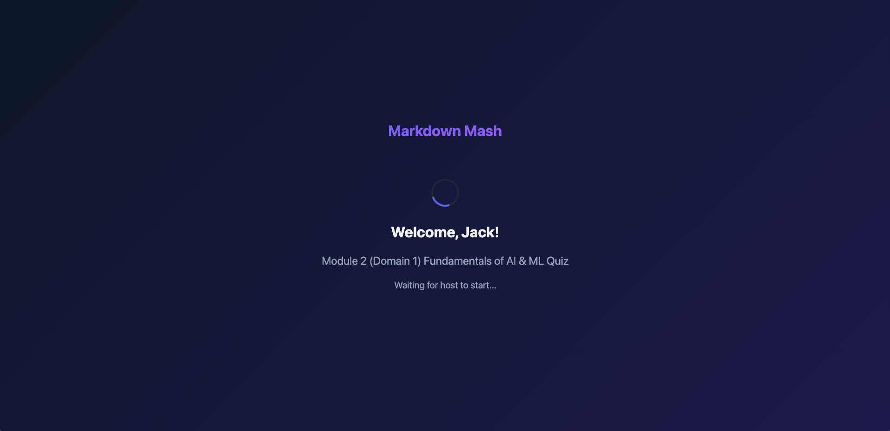
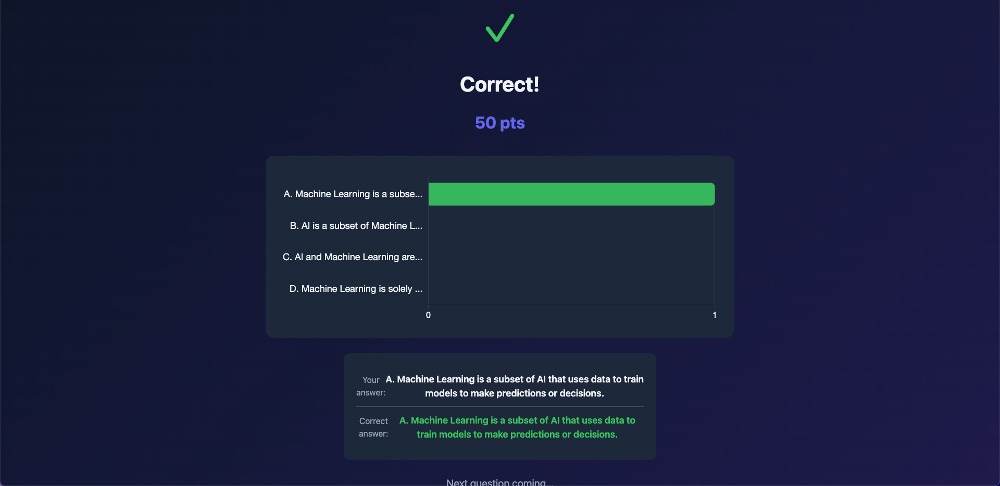
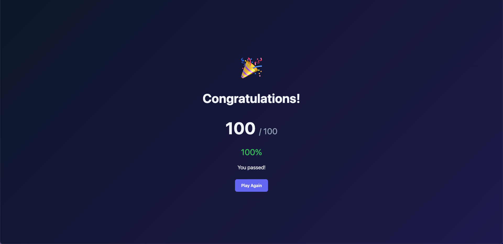
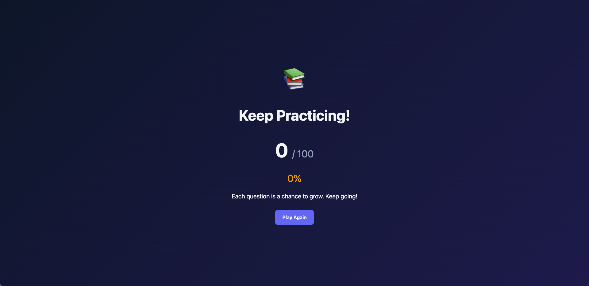

# Markdown Mash

A lightweight, real-time quiz application for classrooms and events. Host interactive quizzes with live results, scoring, and pass/fail feedback - no accounts required for participants.

## 🚀 Live Demo

**Try it now:** [https://markdownmash.onrender.com](https://markdownmash.onrender.com)

> **Note:** The free tier spins down after inactivity. First visit may take 30 seconds to wake up.

## Features

- **Real-time synchronization** - Questions, timers, and results sync instantly via WebSockets
- **Markdown-based quizzes** - Write questions in simple Markdown format
- **Scoring system** - Set total points, track progress, and show pass/fail results
- **Live response charts** - Players and presenters see answer distribution after each question
- **Presenter mode** - Beautiful full-screen view optimized for projection/screen sharing
- **Premium design** - Gradient backgrounds, circular timers, and smooth animations
- **Mobile-optimized** - Smart mobile UI hides redundant info when watching shared screen
- **Zero setup for participants** - Students just enter their name and play
- **Self-hosted** - Deploy on Render, Railway, or any Node.js host


## Screen Shots

#### Admin Screen 

Loading Questions using a Markdown Template 



View progress, control flow (start, end early ..etc), and finally when done you can view summary 



#### Presentation Screen

If needed to have a presenter view, there is one that you can share in class or remote setting 




#### Player Screen

Each player will have their own view 






A final score will be presented for each user 






## Tech Stack

- **Backend:** Node.js, Express, Socket.IO
- **Frontend:** Vanilla HTML/CSS/JavaScript
- **Charts:** Chart.js
- **Deployment:** Render.com (free tier compatible)

## Quick Start

### Prerequisites

- Node.js 18+

### Installation

```bash
git clone https://github.com/yourusername/markdown-mash.git
cd markdown-mash
npm install
npm start
```

Open `http://localhost:3000` in your browser.

- **Admin Dashboard:** `http://localhost:3000/admin.html`
- **Participant Join:** `http://localhost:3000/play.html`
- **Presenter View:** `http://localhost:3000/present.html`

Default admin password: `admin123`

## Quiz Format

Create quizzes in Markdown format:

```markdown
# My Quiz Title
# Score 100

## Q1: What is the capital of France?
- [ ] London
- [x] Paris
- [ ] Berlin
- [ ] Madrid
::time=20

## Q2: Which language runs in web browsers?
- [ ] Java
- [ ] Python
- [x] JavaScript
- [ ] C++
::time=15

## Q3: Is the Earth flat?
- [ ] True
- [x] False
::time=10
```

### Format Rules

| Element | Syntax | Description |
|---------|--------|-------------|
| Quiz title | `# Title` | Single `#` at the start |
| Total score | `# Score 100` | Points distributed across questions (default: 100) |
| Question | `## Q1: Text` | The `Q1:` prefix is optional |
| Wrong answer | `- [ ] Option` | Unchecked checkbox |
| Correct answer | `- [x] Option` | Checked checkbox |
| Time limit | `::time=20` | Seconds per question (default: 20) |

### Scoring

- Set total points with `# Score X` (e.g., `# Score 1000`)
- Points are divided equally among questions
- Participants see their score after each question
- At the end: **Pass** (70%+) or motivating message to study more

## Hosting a Quiz

1. **Load the quiz**
   - Go to Admin Dashboard
   - Paste your Markdown quiz
   - Click "Load Quiz"

2. **Share the link**
   - Give participants the `/play.html` URL
   - They enter their name to join

3. **Screen sharing (optional)**
   - Open `/present.html` in a new window
   - Share this window with participants for a beautiful full-screen display
   - Participants can still use their own devices to answer

4. **Run the quiz**
   - Click "Start Quiz"
   - Click "Next Question" to advance
   - Use "End Question Early" if everyone answered
   - Participants and presenter view show results after each question

5. **Final results**
   - Click "Show Final Results" after the last question
   - Displays ranked leaderboard in admin view
   - Participants see their individual scores and pass/fail status

## Deployment

### Render.com (Recommended)

1. Push your code to GitHub

2. Go to [Render Dashboard](https://dashboard.render.com) → **New** → **Web Service**

3. Connect your GitHub repository

4. Configure:
   - **Build Command:** `npm install`
   - **Start Command:** `npm start`

5. Add environment variable:
   - `ADMIN_PASSWORD` = your secure password

6. Deploy

The free tier spins down after 15 minutes of inactivity. First request after sleep takes ~30 seconds.

### Environment Variables

| Variable | Default | Description |
|----------|---------|-------------|
| `PORT` | `3000` | Server port |
| `ADMIN_PASSWORD` | `admin123` | Admin login password |

## Development

```bash
# Run with auto-reload
npm run dev

# Simulate participants for testing
npm run simulate      # 3 participants
npm run simulate 10   # 10 participants
```

## Project Structure

```
markdown-mash/
├── server.js              # Express + Socket.IO server
├── package.json
├── render.yaml            # Render.com deployment config
├── sample-quiz.md         # Example quiz with scoring
├── test-simulation.js     # Participant simulator
└── public/
    ├── index.html         # Landing page
    ├── admin.html         # Host dashboard
    ├── play.html          # Participant view (mobile-optimized)
    ├── present.html       # Presenter view (for screen sharing)
    ├── css/
    │   └── style.css      # All styles including presenter & player
    └── js/
        ├── admin.js       # Admin client logic
        ├── play.js        # Participant client logic
        └── present.js     # Presenter client logic
```

## Limitations

- Single quiz session at a time (no multi-room support)
- In-memory storage (data resets on server restart)
- No persistent user accounts
- No image/media support in questions

## License

MIT
